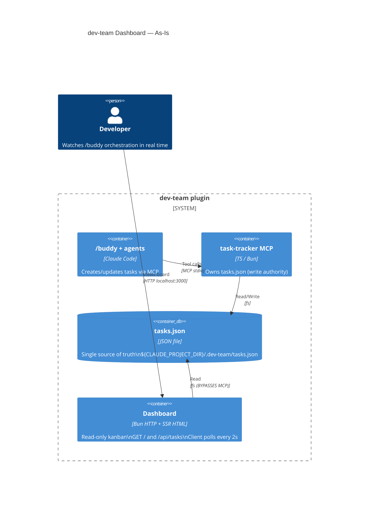
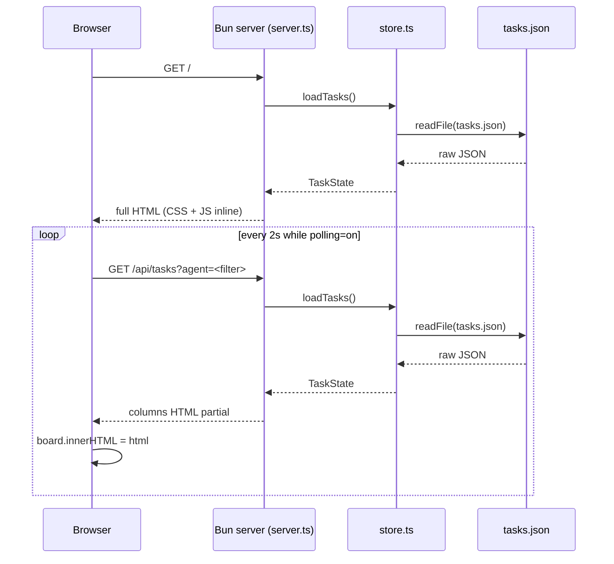

# Dashboard Architecture (ADR-0001)

**Status:** Proposed
**Date:** 2026-04-26
**Owner:** system-architect
**Component:** `dashboard/` — kanban view of the dev-team task-tracker MCP

---

## 1. Context

The `dev-team` plugin coordinates a multi-agent dev team via the `task-tracker` MCP, which persists state to `${CLAUDE_PROJECT_DIR}/.dev-team/tasks.json`. The `dashboard/` directory is an untracked Bun-served HTML kanban board that lets a human watch agent activity in real time. It is not yet wired into the plugin's installation flow, has no tests, no error UI, and reads task state directly from the JSON file (bypassing the MCP).

This ADR captures the as-is, ranks the top 5 improvements, and hands off implementation work to `ui-ux-designer`, `product-manager`, and `frontend-developer`.

### Source files inventoried

| Path | Purpose | LOC |
|---|---|---|
| `dashboard/package.json` | Bun manifest; `dev` and `start` scripts | 14 |
| `dashboard/src/server.ts` | Bun HTTP server, two routes (`/`, `/api/tasks`) | 45 |
| `dashboard/src/store.ts` | Reads `tasks.json` from `${CLAUDE_PROJECT_DIR}/.dev-team/` | 35 |
| `dashboard/src/types.ts` | Mirrors task-tracker types (Task, TaskState, Artifact) | 37 |
| `dashboard/src/render.ts` | Full-page SSR (HTML + inline CSS + inline JS) | 384 |
| `dashboard/src/partial.ts` | Columns-only SSR for poll endpoint (duplicates render.ts) | 116 |

No tests, no README, no Dockerfile, no env schema, no CI integration, not referenced from `plugin.json`.

---

## 2. As-Is C4 Container View

### As-Is request flow

### Key observations

- **Read path bypasses the MCP.** Dashboard goes directly to `tasks.json`. No risk of write contention (dashboard is read-only) but it duplicates the `Task` type and the column/colour config across two files.
- **Polling, not push.** Fixed 2 s interval regardless of whether anything changed; every poll re-reads the full file and re-renders all columns.
- **Render.ts and partial.ts duplicate ~100 lines.** Same `COLUMNS`, `AGENT_COLORS`, `esc`, `timeAgo`, `agentBadge`, `renderCard`, `renderColumn`. Drift risk is real.
- **CSS and JS are inlined in `render.ts`.** ~200 lines of CSS as a template literal; no source maps, no caching, no minification.
- **No error surface.** A malformed `tasks.json` throws (caught only for `ENOENT`); the user sees a 500 with no UI. Network errors in the poller are swallowed (`catch {}`).
- **Auth-free, host-bound only by `PORT`.** Binds `0.0.0.0` by default (Bun.serve default) — anyone on the LAN can read agent task descriptions, which often contain code paths and prompts.
- **Not in plugin.json.** No way for an installed user to launch the dashboard via plugin commands; they must `cd dashboard && bun dev` manually.
- **No accessibility hooks.** Colour-only status indicators, no ARIA roles on the board, `
` is the only keyboard affordance, focus styles are minimal.
- **No tests.** Render functions are pure and trivial to snapshot; nothing exists.

---

## 3. Decision: Top 5 Ranked Improvements

Each improvement is a separately shippable unit. Rank reflects user-visible value × implementation cost.

### #1 — Deduplicate render code; extract CSS/JS to static assets

**Problem:** `render.ts` (384 LOC) and `partial.ts` (116 LOC) duplicate column config, agent colours, and card/column renderers. CSS and client JS are template-literal strings inside `render.ts`.

**Decision:** Extract a shared `components.ts` that exports `renderCard`, `renderColumn`, `COLUMNS`, `AGENT_COLORS`. Move CSS to `public/styles.css` and client JS to `public/client.js`, served by Bun's static file handling. `render.ts` becomes the page shell; `partial.ts` becomes a 10-line wrapper.

**Consequences:** -200 LOC, single source of truth for visuals, browser caching, easier to iterate on styling without rebuilding.

**Owner:** `frontend-developer`. **Effort:** S.

---

### #2 — Replace 2 s polling with Server-Sent Events

**Problem:** Every browser tab issues a full file read + full board re-render every 2 s, even when nothing changed. With 50 tasks the partial response is ~30 KB; with multiple watchers open the file is hammered.

**Decision:** Add `GET /api/events` as an SSE endpoint. Server watches `tasks.json` with `fs.watch` (or polls the file mtime once per second), pushes a single `tasks-updated` event when the mtime advances. Client replaces `setInterval(refresh, 2000)` with an `EventSource` listener that calls `refresh()` on event.

**Alternative rejected:** WebSockets. Overkill — traffic is one-way server→client; SSE auto-reconnects, works through plain HTTP, no protocol upgrade.

**Alternative rejected:** Long-polling. Worse than SSE on every axis (more code, no auto-reconnect, harder to debug).

**Consequences:** Near-zero idle traffic; instant updates on agent state change; one extra route; SSE has a known 6-connection-per-host limit in Chrome, fine for a local dashboard.

**Owner:** `frontend-developer` + small backend stub. **Effort:** M.

---

### #3 — Wire the dashboard into the plugin (`/dev-team:dashboard` command)

**Problem:** End-users who install the plugin from the marketplace cannot launch the dashboard. There is no command, no MCP integration, no docs.

**Decision:** Add a slash command `commands/dashboard.md` in the plugin that:

1. Resolves `${CLAUDE_PLUGIN_ROOT}/../../dashboard` (or wherever the plugin layout puts it).
2. Spawns `bun run --cwd <path> start` with `CLAUDE_PROJECT_DIR` exported.
3. Opens `http://localhost:3000` and tails the server log.

Add a `dashboard` field to `plugin.json` capabilities (advisory) and a `dashboard/README.md` with run instructions.

**Alternative rejected:** Bundle the dashboard as an MCP server resource. The MCP spec is for tools/resources, not long-running web servers; mismatch.

**Consequences:** First-class UX for installed users; one new command file; one path-resolution edge case (Google-Drive-mounted paths with spaces — already the local repo state, must be tested).

**Owner:** `product-manager` (UX spec) → `frontend-developer` (impl) → `github-manager` (PR). **Effort:** S.

---

### #4 — Error states, loading skeletons, and a11y pass

**Problem:** Empty `tasks.json` shows "No tasks" in five columns with no guidance. Malformed JSON 500s with no UI fallback. Polling failures fail silently. Status is conveyed by colour only; the `
` summary lacks ARIA wiring.

**Decision:**

- **Empty state:** when `tasks.length === 0`, replace columns with a centred panel: "No tasks yet — run `/buddy <request>` to get started."
- **Error boundary:** wrap `loadTasks` failure in an HTML page that shows the parse error and the path it tried to read.
- **Polling banner:** if 3 consecutive `/api/tasks` calls fail, show a top banner "lost connection — retrying"; clear on next success.
- **a11y:** add `role="region" aria-label="<status> tasks"` to columns, `aria-expanded` wired to `
`, status dots get text-equivalent labels for screen readers, focus-visible outlines on cards.

**Owner:** `ui-ux-designer` (visual + a11y spec) → `frontend-developer` (impl). **Effort:** M.

---

### #5 — Bind to localhost only; document the trust model

**Problem:** Bun.serve defaults to `0.0.0.0`. Task descriptions frequently contain file paths, prompts, and (in PRD-style tasks) product roadmap detail. Anyone on the LAN can `curl http://<host>:3000/api/tasks?json`.

**Decision:** Add `hostname: "127.0.0.1"` to `Bun.serve`. Add a `dashboard/README.md` "trust model" section: localhost-only, no auth, never expose to public networks, no PII guarantees on task content. If multi-user access is ever needed, that is a separate ADR.

**Alternative rejected:** Add token auth. Premature — the dashboard is a local dev tool. Auth introduces config surface (env var, token rotation) for a property nobody has asked for.

**Owner:** `frontend-developer` (one-liner) + `product-manager` (README copy). **Effort:** XS.

---

## 4. Non-Goals

- Write actions from the dashboard (creating/cancelling tasks). The MCP is the write authority; mixing read and write paths invites contention bugs.
- Auth, multi-tenant, or remote access. This is a localhost dev tool.
- Replacing the file-based store with a database. `tasks.json` is durable, diffable, and grep-able; that is a feature.
- A drag-and-drop kanban. Statuses are agent-managed, not human-managed.
- Migrating away from server-rendered HTML to React/Vue/Svelte. The current SSR + tiny client JS is the right size for this surface.
- Production hardening (TLS, structured logs, health checks). Out of scope until #3 + #5 ship.

---

## 5. Backend Contract Changes

**None required for #1, #4, #5.** They are dashboard-internal.

**For #2 (SSE):** the dashboard adds `GET /api/events` (SSE). No change to the task-tracker MCP, no change to `tasks.json` schema. The dashboard observes the file's mtime; the MCP already writes the file atomically (verify in `task-tracker/src/store.ts`).

**For #3 (plugin command):** no MCP contract change. A new slash command is plugin metadata, not an MCP tool.

**Verification needed before #2 lands:** confirm `task-tracker`'s write path is atomic (write-temp + rename, not in-place truncate). If it is in-place, the dashboard can momentarily read a half-written file. If so, file an issue against `task-tracker` to fix the writer; do not work around it in the dashboard.

---

## 6. Hand-off Tasks

| # | To agent | Title | Depends on |
|---|---|---|---|
| 1 | ui-ux-designer | Spec the empty/error/loading states + a11y pass for the kanban (improvement #4) | this ADR |
| 2 | product-manager | Write README + trust-model copy + `/dev-team:dashboard` command UX (improvements #3, #5) | this ADR |
| 3 | frontend-developer | Refactor: extract `components.ts`, move CSS/JS to `public/`, deduplicate render/partial (improvement #1) | this ADR |
| 4 | frontend-developer | Implement SSE `/api/events` endpoint and replace polling (improvement #2) | task #1, verification of MCP atomic write |
| 5 | frontend-developer | Implement empty/error/loading states and a11y wiring per ui-ux-designer spec (improvement #4) | task #1, ui-ux-designer spec |
| 6 | frontend-developer | Add `hostname: "127.0.0.1"` + plugin `commands/dashboard.md` per product-manager spec (improvements #3, #5) | task #2 |

The system-architect does not own the implementation tasks above; `/buddy` should create them with `dependsOn: [<this ADR's task id>]`.

---

## 7. Rejected Alternatives (summary)

| Alternative | Why rejected |
|---|---|
| Replace SSR with React/Next.js SPA | Overweight for a kanban view of a local JSON file; loses the zero-build deploy story. |
| Add WebSockets for live updates | One-way data flow makes SSE simpler and equivalent. |
| Bundle dashboard as an MCP resource | MCP spec is tool/resource-oriented, not for long-running web servers. |
| Token auth on the HTTP server | Localhost binding solves the threat model with no config surface. |
| Migrate state to SQLite | `tasks.json` is human-readable, diffable, and the MCP already owns it; no current pain. |
| Drag-and-drop status changes | Statuses are agent-managed; user-driven moves would race the MCP. |
