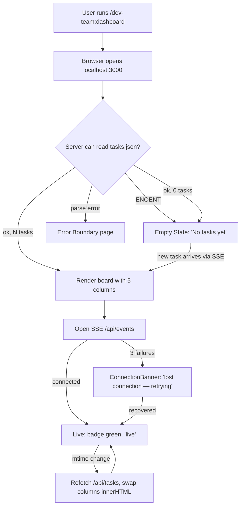
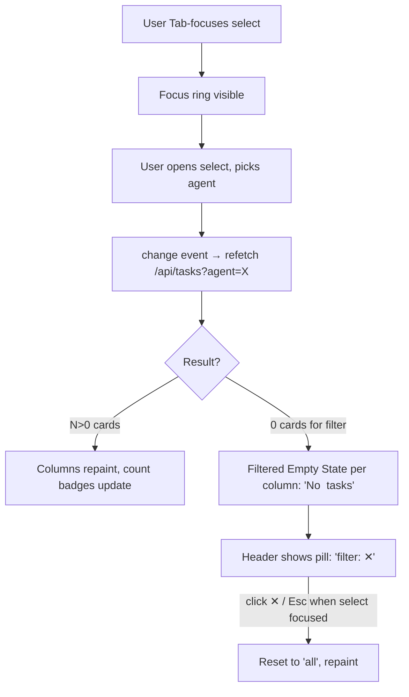

# Dashboard UX Spec

**Status:** Proposed
**Date:** 2026-04-26
**Owner:** ui-ux-designer
**Implements:** ADR-0001 improvement #4 (empty/loading/error states + a11y) and design contracts referenced by #1, #2, #3, #5
**Component:** `dashboard/` — Bun SSR kanban for the dev-team task-tracker

This spec is the contract `frontend-developer` implements against. It does not contain runnable code; component contracts use TypeScript-shaped pseudocode for clarity only.

---

## 1. Goals & Non-goals

### Goals

- Define every user-visible state for the kanban: empty, loading, error, partial, live, paused, disconnected.
- Lock down information hierarchy and density so cards do not bloat as task descriptions grow.
- Specify keyboard navigation, ARIA roles, and WCAG 2.2 AA color contrast for the existing dark theme.
- Provide component contracts (`Card`, `Column`, `Board`, `Filter`, `AgentBadge`, `ConnectionBanner`, `EmptyState`, `ErrorBoundary`) that frontend-developer can implement without re-deciding visual or behavioral questions.

### Non-goals

- New features (write actions, drag-and-drop, multi-select). The MCP is the write authority.
- Re-skinning. Existing palette is kept; only contrast and a11y wiring change.
- Mobile/touch optimisation. Desktop-first, viewport ≥ 1024 px.
- Light theme. Dark theme only; covered by contrast checks below.
- SSE protocol design. Owned by ADR #2; this spec only defines the connection-status surface.

---

## 2. User Flows

### 2.1 Board view (entry → first paint → live updates)



### 2.2 Task detail (card expand)

```mermaid
flowchart TD
  A[User Tab-focuses card] --> B[Focus ring visible]
  B --> C[User presses Enter or Space]
  C --> D[details[open] = true, body slides down]
  D --> E[aria-expanded=true announced]
  E --> F{User action?}
  F -- Esc / Enter again --> G[Collapse, focus stays on card]
  F -- Tab --> H[Focus moves to first link inside body]
  F -- click outside --> I[Card stays open, no focus loss]
```

### 2.3 Filter (agent dropdown)



---

## 3. Information Hierarchy & Density

### 3.1 Visual priority (top → bottom of card)

1. **Title** — primary scan target. 13 px, weight 500, 2-line clamp.
2. **Updated time** — temporal anchor. 10 px, weight 500, right-aligned.
3. **Agent badge** — who owns it. 11 px, weight 600, color-coded.
4. **Tags** — secondary classifiers. 11 px, weight 500, neutral chip.
5. **Dependency hint** — "⤹ depends on N tasks". Only when `dependsOn.length > 0`.
6. **(Expanded only)** description → result → artifacts → depends-on IDs → task ID.

The collapsed card surface stays under 100 px tall. Title 2-line clamp is the primary density lever; do not lift it.

### 3.2 Column density rules

- **Card spacing:** 10 px gap between cards (current). Hold.
- **Column width:** 300 px fixed (current). Hold.
- **Max cards before scroll:** column scrolls internally past `100vh - 90px`. The board itself does NOT vertically scroll — only columns do.
- **Count badge:** always visible in column header, even at 0. At 0, render with `.empty` styling (muted), not hidden.
- **Sort within column:** by `updatedAt` desc (current). Hold.

### 3.3 Header density

| Element | Priority | Behavior at narrow widths (< 1280 px) |
|---|---|---|
| `dev-team` brand + label | P1 | Always visible |
| Progress bar + N/M done | P2 | Hidden below 1100 px |
| Agent filter | P1 | Always visible |
| Live/paused toggle | P1 | Always visible |
| Refresh button | P3 | Hidden below 1100 px (SSE makes manual refresh redundant; keep as fallback only) |
| Last-update timestamp | P2 | Hidden below 1280 px; moved to title attribute on the live badge |

---

## 4. Empty / Loading / Error States

### 4.1 Empty state — zero tasks total

Trigger: `tasks.length === 0` after a successful read.

Replaces the entire `<main>` (not the columns):

```
┌─────────────────────────────────────────────────┐
│                                                 │
│                  📋                             │
│                                                 │
│            No tasks yet                         │
│                                                 │
│   Run /buddy <request> to get started.          │
│                                                 │
│   The dashboard updates live as agents          │
│   pick up tasks.                                │
│                                                 │
└─────────────────────────────────────────────────┘
```

- Centered vertically and horizontally in the viewport.
- Heading 18 px / 600 weight, body 13 px / 400, secondary line 12 px / 400 in `#a1a1aa`.
- Icon is decorative (`aria-hidden="true"`); the heading carries the meaning.
- No buttons. The action is in the user's terminal, not the browser.

### 4.2 Empty state — filter returns zero

Trigger: filter `≠ all` and filtered tasks count === 0.

Per-column, replaces `.empty` text:

```
No <agent> tasks
in this column
```

- Same `.empty` style (centered, 13 px, `#71717a`).
- Header shows a removable filter pill: `filter: ui-ux-designer  ✕` next to the dropdown. Pressing `Esc` while the select is focused, or Enter on the ✕ button, resets to `all`.

### 4.3 Loading state — first paint

The initial GET `/` is server-rendered, so there is no visible "loading" between request and first paint. The `<main>` always ships with content.

For the SSE-driven refetches (`/api/tasks` partial), use a non-blocking shimmer:

- Add `aria-busy="true"` on `<main>` while a refetch is in flight.
- Apply `.refetching` class which shows a 2 px progress bar on the header bottom border (the existing `.progress-fill` gradient, full-width, indeterminate keyframe).
- Do NOT skeleton-replace the cards. The previous cards stay, then swap. Replacing them flickers and breaks user focus on an open card.

### 4.4 Loading state — first SSE connect

Connection badge starts as `● connecting…` (#a1a1aa, `aria-live="polite"`). On open: `● live` (#34d399). On error: `○ paused` (#a1a1aa).

### 4.5 Error state — top-level (server can't load tasks.json)

The server returns a full HTML error page (200 with friendly framing — not a raw 500):

```
┌─────────────────────────────────────────────────┐
│  dev-team — Kanban                              │
├─────────────────────────────────────────────────┤
│                                                 │
│  ⚠  Could not read task state                   │
│                                                 │
│  Path:                                          │
│    ~/.dev-team/tasks.json              │
│                                                 │
│  Error:                                         │
│    Unexpected token } at position 412           │
│                                                 │
│  This usually means the file was edited by      │
│  hand or written by an older version of the     │
│  task-tracker. Try:                             │
│                                                 │
│    rm <path-above>                              │
│                                                 │
│  …and re-run /buddy.                            │
│                                                 │
│  [↻ Retry]                                      │
│                                                 │
└─────────────────────────────────────────────────┘
```

- `role="alert"` on the panel.
- Path and error message are escaped (XSS guard).
- Retry button reloads the page.
- The header is preserved (brand only — no progress, no filter, no toggle).

ENOENT is NOT an error — that is the empty state (4.1).

### 4.6 Error state — connection lost banner

Trigger: 3 consecutive SSE / partial fetch failures (window: 30 s).

Banner slides in below the header:

```
┌─────────────────────────────────────────────────┐
│ ⚠ Lost connection to server — retrying every 5s │
│                                          [↻ now]│
└─────────────────────────────────────────────────┘
```

- `role="status"`, `aria-live="polite"`.
- Background `rgba(120,53,15,.4)`, border `rgba(251,191,36,.5)`, text `#fef3c7`.
- "↻ now" forces an immediate retry.
- Auto-dismisses on next successful fetch.
- Does NOT cover content; pushes the board down 36 px.

### 4.7 Stale-data indicator (optional, P2)

If the last successful update was > 60 s ago but no error, the live badge changes to `◐ stale` (#fbbf24) with a tooltip "Last update 2m ago — server may be idle". Avoids false alarm when the agent team is genuinely idle.

---

## 5. Accessibility (WCAG 2.2 AA)

### 5.1 Keyboard navigation

| Element | Tab order | Keys |
|---|---|---|
| Skip link ("Skip to board") | 1 | Enter → focus `<main>` |
| Brand / heading | non-interactive, skipped | — |
| Agent filter `<select>` | 2 | ↑↓ to change, Esc to reset to "all" |
| Live/paused toggle `<button>` | 3 | Enter / Space toggles |
| Refresh `<button>` | 4 | Enter / Space triggers fetch |
| Each card `<details><summary>` | 5..N | Enter / Space toggles open; Esc closes when open |
| Links inside expanded card body | N+1..M | Tab moves through; Shift+Tab returns to summary |

Focus order is DOM order (left column → right column, top card → bottom card within column).

**Skip link** is mandatory. Add `<a class="skip-link" href="#board">Skip to board</a>` as first focusable element. Visually hidden until focused; on focus, fixed top-left, `#60a5fa` background, white text, 4 px outline.

**Focus-visible styling:** every interactive element gets a 2 px outline `#60a5fa` with 2 px offset on `:focus-visible`. Cards currently have no focus style — add `outline: 2px solid #60a5fa; outline-offset: 2px;` on `.card:focus-within`.

### 5.2 ARIA roles & labels

| Element | Role / attribute | Value |
|---|---|---|
| `<main id="board">` | `role="region"` `aria-label="Kanban board"` `aria-busy={refetching}` | — |
| Each column `<section>` | `role="region"` `aria-labelledby="col-<status>-h"` | — |
| Column heading `<h2 id="col-<status>-h">` | — | "Pending tasks (3)" — count is part of the accessible name |
| Column count badge | `aria-hidden="true"` | (count is in the heading already) |
| Status dot | `aria-hidden="true"` | (heading conveys status) |
| Card `<details>` | — | native; do NOT add role |
| Card `<summary>` | `aria-describedby="card-<id>-meta"` when collapsed | — |
| Card meta block (agent + tags + deps) | `id="card-<id>-meta"` | — |
| Agent badge | `aria-label="Agent: ui-ux-designer"` | — |
| Live/paused toggle | `aria-pressed={polling}` `aria-label="Toggle live updates"` | — |
| Filter select | `aria-label="Filter by agent"` | — |
| Connection banner | `role="status"` `aria-live="polite"` | — |
| Error page panel | `role="alert"` | — |
| Last-update time | `<time datetime="<iso>">` | machine-readable |

### 5.3 Screen-reader announcements

- New task appears: SSE handler updates `<div aria-live="polite" class="sr-only">` with "1 new task: <title> assigned to <agent>". Throttle to once per 3 s.
- Connection lost: banner's `role="status"` triggers announcement.
- Filter applied: `<div aria-live="polite" class="sr-only">` says "Filtered to <agent>: N tasks".

### 5.4 Color contrast (WCAG AA = 4.5:1 for body text, 3:1 for large/UI)

Audit of the current palette against `#09090b` background and `#18181b` card background. **Bold = currently failing, must fix.**

| Token | Foreground | Background | Ratio | Required | Status |
|---|---|---|---|---|---|
| Body text | `#f4f4f5` | `#09090b` | 18.4:1 | 4.5:1 | OK |
| Card title | `#e4e4e7` | `#18181b` | 13.6:1 | 4.5:1 | OK |
| Card body | `#a1a1aa` | `#18181b` | 5.2:1 | 4.5:1 | OK |
| Card time | `#71717a` | `#18181b` | **3.0:1** | 4.5:1 | **FAIL → use `#a1a1aa`** |
| `.empty` text | `#71717a` | column bg | **~3.0:1** | 4.5:1 | **FAIL → use `#a1a1aa`** |
| `.card-id` text | `#52525b` | `#18181b` | **2.1:1** | 4.5:1 | **FAIL → use `#a1a1aa`** |
| `.deps` text | `#71717a` | `#18181b` | **3.0:1** | 4.5:1 | **FAIL → use `#a1a1aa`** |
| Tag text | `#a1a1aa` | `#27272a` | 4.7:1 | 4.5:1 | OK (tight) |
| Progress text | `#a1a1aa` | header bg | 5.0:1 | 4.5:1 | OK |
| Last-update | `#71717a` | header bg | **3.1:1** | 4.5:1 | **FAIL → use `#a1a1aa`** |
| Agent badge text | per-agent fg | per-agent bg | varies | 4.5:1 | **AUDIT each** — all current pairings test ≥ 4.6:1 against the badge bg, but verify with an automated check before merge |
| Status dot (decorative) | dot color | column bg | n/a | 3:1 (UI) | OK — but dot must NOT be the only status signal; the column heading text carries status |

**Color is never the sole status signal.** Status is conveyed by:

1. The column the card lives in (visual + structural).
2. The column's heading text (programmatic, e.g. "Completed tasks (12)").
3. The dot (decorative reinforcement).

This satisfies WCAG 1.4.1 (Use of Color).

### 5.5 Motion

- `.card` hover lift (`translateY(-1px)`) and `details[open]` sweep animation: wrap in `@media (prefers-reduced-motion: reduce) { animation: none; transition: none; }`.
- Progress bar `width` transition: also gated by `prefers-reduced-motion`.

### 5.6 Zoom & reflow

- Layout must reflow without horizontal scroll up to 200% zoom on a 1280 px viewport.
- The board's `overflow-x: auto` is the only intentional horizontal scroll. Acceptable per WCAG 1.4.10 since it's a data table-like structure.

---

## 6. Component Contracts

These are design contracts. `frontend-developer` may choose any function/file shape, but the props, events, and states below are fixed.

### 6.1 `<AgentBadge>`

```ts
interface AgentBadgeProps {
  agent: string;             // e.g. "ui-ux-designer"
}
// Output: <span class="badge" aria-label="Agent: ui-ux-designer" style="bg/fg from AGENT_COLORS">…</span>
```

States: default only. Unknown agent → fallback colors (existing behavior). Must keep the `aria-label` even though text content is the same — screen readers benefit from the prefix.

### 6.2 `<Card>`

```ts
interface CardProps {
  task: Task;                // from types.ts
}
```

States:

| State | Trigger | Visual |
|---|---|---|
| collapsed (default) | `<details>` not open | header only, ~80–96 px |
| collapsed + focused | `:focus-visible` on summary | 2 px `#60a5fa` outline, offset 2 px |
| expanded | user toggled | body visible, sweep animation (or none if reduced motion) |
| hover | pointer over card | -1 px translate, deeper shadow |
| stale (P3) | `updatedAt` > 1 h ago AND status `in_progress` | time text shifts to `#fbbf24` |

A11y:

- `<summary>` has accessible name = title text.
- `aria-describedby` points to a hidden meta string for screen readers when collapsed.
- Title 2-line clamp is mandatory; full title goes in `title` attribute on the summary.
- `card-id` text contrast fix: `#a1a1aa` on `#18181b`.

Acceptance for impl:

- [ ] Card renders with task fields exactly per current `renderCard` shape.
- [ ] Card has visible focus ring on keyboard focus, no ring on mouse focus.
- [ ] Expanded state animation is suppressed under `prefers-reduced-motion`.
- [ ] Title overflow shows tooltip via `title=` attribute.
- [ ] All text passes 4.5:1 against its background.

### 6.3 `<Column>`

```ts
interface ColumnProps {
  status: TaskStatus;
  tasks: Task[];             // pre-filtered to this status
  filterAgent: string | null;// for empty-state copy
}
```

States:

| State | Trigger | Visual |
|---|---|---|
| populated | tasks.length > 0 | cards stacked, count > 0 |
| empty (no tasks anywhere) | tasks.length === 0 AND filterAgent === null | `.empty` text "No tasks", count = 0 |
| empty (filtered out) | tasks.length === 0 AND filterAgent !== null | `.empty` text "No <agent> tasks in this column", count = 0 |
| loading (refetching) | parent `aria-busy="true"` | (no per-column change; whole-board indicator handles it) |

A11y:

- `<section role="region" aria-labelledby="col-<status>-h">`.
- `<h2 id="col-<status>-h">` accessible name MUST include count (e.g. "In Progress tasks (3)") so screen readers don't need to also read the badge.
- Status dot `aria-hidden="true"`.

Acceptance for impl:

- [ ] Heading id is unique per status.
- [ ] Heading accessible name includes count and status.
- [ ] Empty-filtered copy uses the agent name from `filterAgent`.
- [ ] Column scrolls internally; board does not.

### 6.4 `<Board>`

```ts
interface BoardProps {
  state: TaskState;
  filterAgent: string | null;
  isRefetching: boolean;
}
```

States: empty (zero tasks total) / populated / refetching / error (handled by ErrorBoundary).

A11y:

- `<main role="region" aria-label="Kanban board" aria-busy={isRefetching}>`.
- Skip-link target = `#board`.

Acceptance for impl:

- [ ] When `state.tasks.length === 0`, render `<EmptyState />`, not 5 empty columns.
- [ ] Skip link is the first focusable element on the page.
- [ ] `aria-busy` toggles during refetch.

### 6.5 `<Filter>` (header agent select + reset pill)

```ts
interface FilterProps {
  agents: string[];          // unique, sorted
  selected: string | "all";
  onChange: (agent: string | "all") => void;
}
```

States: default / focused / open (native) / applied (selected !== "all" → reset pill visible).

A11y:

- `<select aria-label="Filter by agent">`.
- Reset pill is a `<button aria-label="Clear filter">filter: <agent> ✕</button>`.
- Esc on the select resets to "all" (custom keydown handler).

Acceptance for impl:

- [ ] Reset pill renders only when selected !== "all".
- [ ] Esc on focused select fires `onChange("all")`.
- [ ] Filter change announces the new count via the polite live region.

### 6.6 `<ConnectionBanner>`

```ts
interface ConnectionBannerProps {
  state: "connected" | "connecting" | "lost" | "stale";
  onRetry: () => void;
}
```

States:

| state | Render |
|---|---|
| `connected` | not rendered |
| `connecting` | not rendered (live badge shows "connecting…") |
| `lost` | banner visible with retry button, `role="status"` |
| `stale` | not a banner — only the live badge changes (see 4.7) |

Acceptance for impl:

- [ ] Banner only mounts on `lost`; auto-unmounts on `connected`.
- [ ] `aria-live="polite"`.
- [ ] Retry button has accessible name "Retry connection now".

### 6.7 `<EmptyState>`

```ts
interface EmptyStateProps {
  variant: "no-tasks" | "filtered-zero";
  agent?: string;            // required when variant === "filtered-zero"
}
```

Acceptance for impl:

- [ ] Uses heading + body copy from §4.1 / §4.2 verbatim.
- [ ] Icon is `aria-hidden="true"`.
- [ ] No interactive elements.

### 6.8 `<ErrorBoundary>`

```ts
interface ErrorBoundaryProps {
  path: string;              // tasks.json path
  message: string;           // parser error message
  onRetry: () => void;       // reload
}
```

Acceptance for impl:

- [ ] Server-rendered (no client JS required).
- [ ] `path` and `message` HTML-escaped.
- [ ] Panel has `role="alert"`.
- [ ] Retry button reloads page.

### 6.9 Live region (singleton)

Every page mounts:

```html
<div id="sr-live" class="sr-only" aria-live="polite" aria-atomic="false"></div>
```

Used by: filter changes, new-task announcements (throttled), and connection state announcements that don't already use `role="status"`.

`.sr-only` is the standard visually-hidden utility (1 px clip).

---

## 7. Tokens (no additions)

The current palette is sufficient. Existing tokens:

- Surfaces: `#09090b` (page), `#18181b` (card), `#27272a` (chip), per-status column bg.
- Text: `#f4f4f5`, `#e4e4e7`, `#d4d4d8`, `#a1a1aa`. **Drop `#71717a` and `#52525b` from text use** — they fail 4.5:1. Reuse `#a1a1aa` instead. They remain valid for borders and decorative use.
- Accents: `#60a5fa` (focus + info), `#34d399` (live + completed), `#fbbf24` (blocked + stale), `#f87171` (cancelled), `#fca5a5` (error fg).

**No new tokens introduced.** This keeps the design-system footprint flat and avoids the sprawl tax.

---

## 8. Acceptance for impl (master checklist)

`frontend-developer` ticks these to consider the spec implemented:

### Structure

- [ ] Skip link is first focusable element on the page.
- [ ] `<main>` has `role="region"` and `aria-label="Kanban board"`.
- [ ] Each column is a `<section role="region">` with a labelling heading.
- [ ] Column heading accessible name includes count and status.

### States

- [ ] Empty state (zero tasks) replaces `<main>` content per §4.1.
- [ ] Filtered empty per column uses copy from §4.2.
- [ ] Error boundary HTML page renders per §4.5 on parse failure.
- [ ] ConnectionBanner shows after 3 consecutive failures and clears on next success.
- [ ] `aria-busy` toggles on refetch; no skeleton swap.

### Accessibility

- [ ] All interactive elements have `:focus-visible` ring (2 px `#60a5fa`, 2 px offset).
- [ ] Live region (`#sr-live`) announces filter changes and new tasks (throttled 3 s).
- [ ] All text passes 4.5:1 contrast (`#71717a`/`#52525b` removed from text usage).
- [ ] `prefers-reduced-motion` disables card hover lift, expand sweep, progress bar transition.
- [ ] Status conveyed by column structure + heading text, not color alone.
- [ ] Esc on focused agent select resets to "all".

### Behavior

- [ ] Live badge cycles `connecting…` → `live` → `paused` / `stale` per §4.4 / §4.7.
- [ ] Refresh button retained as fallback but hidden < 1100 px.
- [ ] Card `title` attribute holds full title for clamped lines.

---

## 9. Hand-off

`frontend-developer` implements:

1. The contracts in §6.
2. The state behaviors in §4.
3. The a11y requirements in §5.

Open questions for `product-manager`:

- §4.5 error copy ("…try `rm <path>`…") — confirm we want to suggest deleting state. Alternative: link to a docs page. **Default for impl: ship the copy as written; PM can soften later.**
- §4.7 stale indicator — P2; ship without, add when there's a complaint about false positives on "live" being green when nothing's moved in hours.

Open questions for `system-architect`:

- SSE event payload shape — out of scope here; this spec only assumes "an event arrives" and a refetch is triggered.

No backend contract change required by this spec.
